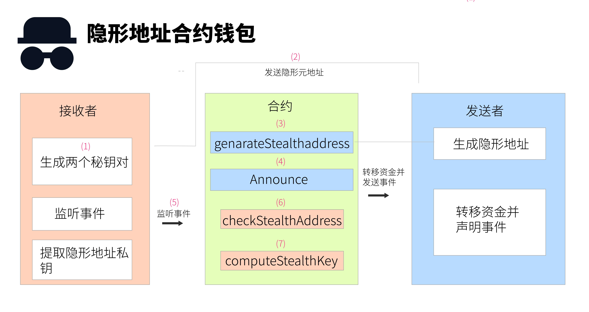

# Project Name: Privacy Account Implementation with Cairo Language

## Introduction
The initial standard for privacy accounts came from EIP5564, which can be found at [EIP5564](https://eips.ethereum.org/EIPS/eip-5564). Originally, it was implemented on the Ethereum blockchain. However, since the encryption algorithm used can be implemented in any programming language, Cairo, being a language more versatile than Solidity, is considered for implementing it on StarkNet.

## Team Members
- Maxlion: Advisor and guide of the project.
- LongRoad: Responsible for the development and implementation of the project.
## Contract Interaction

1. The recipient generates two private keys, `p_spend` and `p_view`, along with their corresponding public keys: `P_spend` and `P_view`.
2. The recipient publishes a Meta address composed of the public keys: `meta-address = P_spend + P_view`.
3. The sender calls the `generateStealthAddress(meta-address)` method of the ERC5564Messenger contract to generate:
   - Recipient's stealth address: `stealthAddress`
   - Ephemeral public key: `ephemeralPubKey`
   - View Tag: `viewTag`
4. The sender declares the asset transfer information to the privacy address through the Announce contract. This contract is a singleton, meaning there is only one unique contract on each blockchain. Its purpose is to publish the Announcement event, which should generally occur when the sender transfers assets to `stealthAddress`.
5. The recipient listens to the Announcement event and calls the `checkStealthAddress` method of the messenger contract:
   ```solidity
   function checkStealthAddress(
         address stealthAddress,
         bytes calldata ephemeralPubKey,
         bytes calldata viewingKey,
         bytes calldata spendingPubKey
       ) external view returns (bool)
   ```
   This method verifies if the stealth address, ephemeral public key, and the recipient's own `p_view` and `P_spend` are related (returns true).
6. Once the recipient verifies that the stealth address is related to themself, they call the `computeStealthKey` method of the messenger contract:
   ```solidity
   function computeStealthKey(
     address stealthAddress,
     bytes memory ephemeralPubKey,
     bytes memory spendingKey
   ) external view returns (bytes memory);
   ```
   This method returns the private key for the stealth address.

## Cairo Source File Directory
The Cairo source files for this project can be found at:
`cairoEIP5564`

If you have any further questions or need assistance with anything else, feel free to ask!